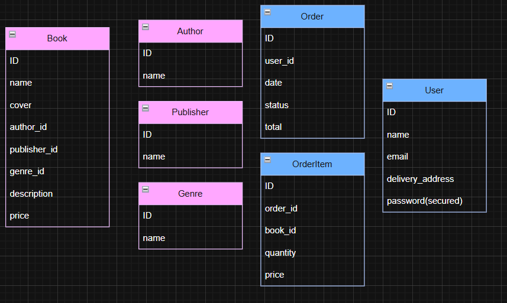

# bookstore_project_Havryliuk

### Bookstore API with Django REST Framework

An online bookstore web application with the following features:

-	Book catalog with search filters and sorting. 

-	Book details page with extended information. 

-	Authors page showing all authors, each author page lists their available books.

-	Publishers page with a list of publishers and their books.

-	Admin features to add, edit, and delete books, authors, and publishers.

-	User accounts with registration and login.

-	User profile with order history and editable personal data.

-	Shopping cart: logged-in users can add books to their cart and place orders.

-	About page with contact info, delivery, and return policies.

## Requirements
- Python 3.8+
- Django 4.2+

## Installation

After you clone the repository, create a virtual environment:

```bash
python -m venv env
source env/bin/activate  # On Windows: env\Scripts\activate
```
Install required dependencies:
```bash
pip install -r requirements.txt
```
Run migrations and start the server:
```bash
python manage.py migrate
python manage.py runserver
```
Run tests:
```bash
pytest tests/app/test.py
```

## API Endpoints Documentation

## Frontend Pages

| Page | URL | Description |
|------|-----|-------------|
| Home | `/home` | Homepage with about us information |
| Books | `/books` | List of all books with search and filters |
| Book Detail | `/books/<id>` | Detailed information about a specific book |
| Authors | `/authors` | List of all authors |
| Author Detail | `/authors/<id>` | Author details and their books |
| Publishers | `/publishers` | List of all publishers |
| Publisher Detail | `/publishers/<id>` | Publisher details and their books |
| Add Data | `/admin/data` | Admin panel for adding new data |
| Sign In | `/auth/sign_in` | User registration page |
| Log In | `/auth/log_in` | User login page |
| Log Out | `/auth/log_out` | User logout page |
| User Profile | `/users/user<id>` | User profile and order history |
| Cart | `/users/user<id>/cart` | Shopping cart page |

### Books

| Action | Request | Request Body | Response Body |
|--------|---------|--------------|---------------|
| Get all books | **GET** `/books/` |  | `[ { "id": 1, "title": "Harry Potter", "author": "J.K. Rowling", "price": 350.00 }, ... ]` |
| Get book details | **GET** `/books/1/` |  | `{ "id": 1, "title": "Harry Potter", "author": { "id": 1, "name": "J.K. Rowling" }, "publisher": { "id": 1, "name": "Bloomsbury" }, "price": 350.00, "description": "Magical adventure..." }` |
| Create new book | **POST** `/books/` | `{ "title": "New Book", "author_id": 1, "publisher_id": 1, "price": 299.99, "description": "Book description..." }` | `{ "id": 2, "title": "New Book", "author": { "id": 1, "name": "J.K. Rowling" }, "price": 299.99, ... }` |
| Update book | **PUT** `/books/1/` | `{ "title": "Harry Potter", "author_id": 1, "price": 400.00, "description": "Updated description..." }` | `{ "id": 1, "title": "Harry Potter", "price": 400.00, ... }` |
| Delete book | **DELETE** `/books/1/` |  |  |

### Authors

| Action | Request | Request Body | Response Body |
|--------|---------|--------------|---------------|
| Get all authors | **GET** `/authors/` |  | `[ { "id": 1, "name": "J.K. Rowling" }, ... ]` |
| Get author details | **GET** `/authors/1/` |  | `{ "id": 1, "name": "J.K. Rowling", "books": [ { "id": 1, "title": "Harry Potter", "price": 350.00 } ] }` |
| Create new author | **POST** `/authors/` | `{ "name": "New Author" }` | `{ "id": 2, "name": "New Author" }` |

### Publishers

| Action | Request | Request Body | Response Body |
|--------|---------|--------------|---------------|
| Get all publishers | **GET** `/publishers/` |  | `[ { "id": 1, "name": "Bloomsbury" }, ... ]` |
| Get publisher details | **GET** `/publishers/1/` |  | `{ "id": 1, "name": "Bloomsbury", "books": [ { "id": 1, "title": "Harry Potter", "author": "J.K. Rowling", "price": 350.00 } ] }` |
| Create new publisher | **POST** `/publishers/` | `{ "name": "New Publisher" }` | `{ "id": 2, "name": "New Publisher" }` |

## Database Schema

